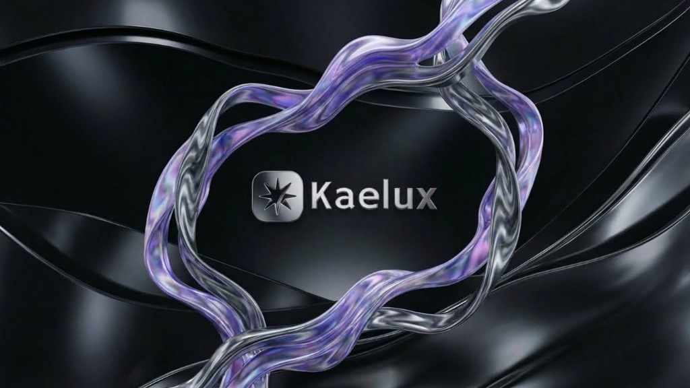
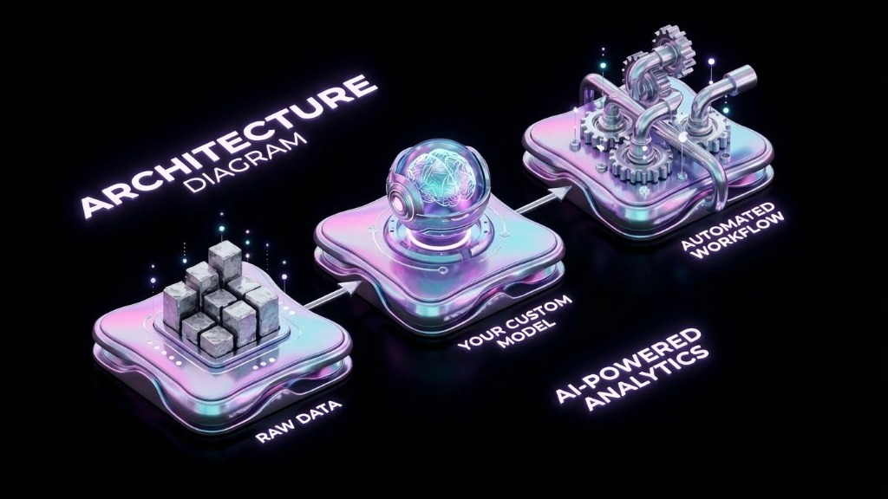

<div align="center">



# Kaelux.dev

### Developer Portfolio & AI Engineering Solutions

[](https://nextjs.org/)
[](https://www.typescriptlang.org/)
[](https://tailwindcss.com/)
[](https://www.framer.com/motion/)

[](LICENSE)
[](https://www.digitalocean.com/)

---

[🌐 **View Live Site**](https://kaelux.dev) • [📫 **Contact Me**](#contact)

</div>

---

## 🧠 AI Engineering Services

<div align="center">



</div>

### Beyond Chatbots: Intelligent Infrastructure for Business

Generic AI models don't understand your business. We build and tune **custom solutions** that do.

By combining tailored AI software with hands-on engineering services, we connect LLMs directly to your existing systems—automating complex tasks and workflows.

#### What We Build

| Service | Description |
|---------|-------------|
| **Custom AI Pipelines** | RAW DATA → Your Custom Model → Automated Workflows |
| **MCP Orchestration** | Model Context Protocol integration for seamless tool connectivity |
| **Workflow Automation** | n8n, LangChain, and custom orchestration layers |
| **AI-Powered Analytics** | Transform data into actionable insights |

---

## 🚀 Featured Projects

Flagship projects showcasing AI integration, workflow automation, and full-stack development.

### 🎯 [PromptTriage](https://github.com/Ker102/PromptTriage)

[](https://nextjs.org/)
[](https://ai.google.dev/)

An intelligent prompt engineering platform using metaprompts, few-shot learning, and orchestrated AI workflows.

- 🔍 Deep prompt analysis with gap detection and risk assessment
- 🛠️ Multi-model optimization (GPT, Claude, Gemini, Grok, Mistral)
- 🌐 Optional Firecrawl web enrichment for context

---

### 🌐 [Crosswind Console](https://github.com/Ker102/Crosswind-Console)

[](https://svelte.dev/)
[](https://fastapi.tiangolo.com/)

A unified research dashboard surfacing job opportunities, travel deals, and social trend insights.

- 🔄 Cross-domain intelligence (Jobs, Travel, Trends)
- 🤖 Gemini 3 Pro integration for AI-powered analysis
- 🌍 MCP server orchestration (Firecrawl, Playwright)

---

### ⚙️ [Kaelux-Automate](https://github.com/Ker102/Kaelux-Automate)

[](https://www.docker.com/)
[](https://n8n.io/)

Enterprise-grade automation builder with AI-powered workflow generation.

- 🧠 LLM-powered workflow generation from natural language
- 📚 Vector database (Qdrant) for workflow exemplar retrieval
- 💳 Stripe integration for subscription management

---

### 🌌 [Workflow-Automation-Atlas](https://github.com/Ker102/n8n-ai-automation-workflow-atlas)

[](https://github.com/Ker102/n8n-ai-automation-workflow-atlas)
[](https://vuejs.org/)

A curated collection of **3,800+ battle-tested n8n workflows** with a Vue + Vite explorer.

- 📦 6 themed workflow collections (AI Lab, RAG Kits, Community Pack)
- 🔍 Vue-based workflow explorer with search and filtering
- 📄 Source licenses preserved for redistribution

---

### 🤖 [Kaelocs-AI](https://github.com/Ker102/Kaelocs)

[](https://nextjs.org/)
[](https://ai.google.dev/)

Modern AI chat application with Google Gemini integration and MCP capabilities.

- 🔐 NextAuth.js with Google OAuth
- 🔍 Brave Search integration for real-time web data
- 📝 Full markdown rendering with syntax highlighting

---

### 🔨 [ModelForge](https://github.com/Ker102/ModelForge)

[](https://www.electronjs.org/)
[](https://www.blender.org/)

AI-powered Blender assistant transforming 3D workflows through natural conversation.

- 🎨 Natural language control for Blender operations
- 🧠 Gemini 2.x orchestration with per-step validation
- 🖥️ Electron desktop app with native MCP connectivity

---

## 📊 Tech Stack

<div align="center">

| Category | Technologies |
|----------|--------------|
| **Frontend** | Next.js 16 • React 19 • Svelte 5 • Vue 3 |
| **Backend** | FastAPI • Node.js • n8n |
| **Languages** | TypeScript • Python • JavaScript |
| **AI/LLM** | Gemini 2.x • GPT-4 • Claude • LangChain |
| **Databases** | PostgreSQL • MongoDB • Qdrant • Redis |
| **Styling** | Tailwind CSS • Framer Motion |
| **Infrastructure** | Docker • Electron • DigitalOcean |

</div>

---

## 🚀 Quick Start

```bash
# Clone the repository
git clone https://github.com/Ker102/Kaelux-DevPotfolio.git
cd DevPotfolio

# Install dependencies
npm install

# Run development server
npm run dev

# Open http://localhost:3000
```

---

## 📊 Performance


---

## 📄 License

This project is open source and available under the [MIT License](LICENSE).

---

<div align="center">

**Built with modern web technologies**

[](https://kaelux.dev)

</div>
